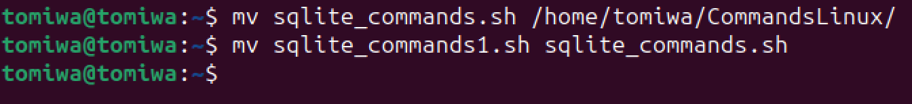
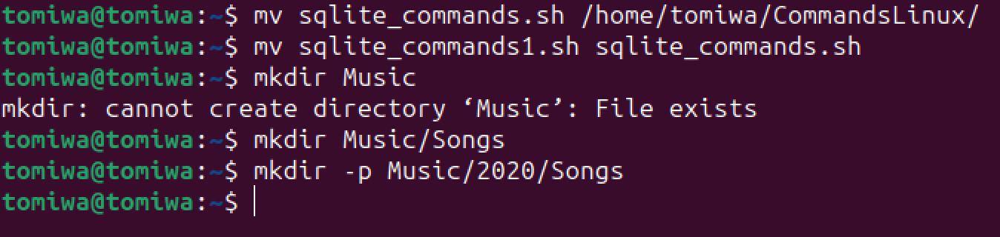
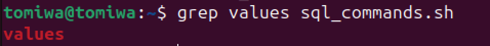

# Linux Practice

## File Manipulation

### 1. sudo command:
sudo stands for "SuperUser DO". It is used to execute a task with elevated privileges. The system will prompt the user to authenticate with a password. Only the root user or users assign sudo priviledges can be authenticated to execute a sudo command

### 2. pwd command:
pwd stands for "print working directory". It returns the current filepath of the current directory

### 3. cd command:
cd stand for "change directory" is used to change the current directory to the directory specified. Options/flags can be specified to extend the functionality

### 4. ls command:
the ls command is used to list the directories and files in the current directory. Options/flags can be specified to extend the functionality

### 5. cat command:
cat stands for concatenate. It is used output the content of a file to the command line or merge files

### 6. cp command:
cp stands for copy. It copies files, directories to a specified location

### 7. mv command:
mv is the move commands that is used for moving files & directories to new locations or change the name of a file or directory

### 8. mkdir command:
mkdir is the command to create a new directory

### 9. rmdir command:
this command deletes an empty directory

### 10. rm command:
removes files. Where paired with with "-r" flag, removes files and directories

### 11. touch command:
create a new empty file

### 12. locate command:
Used to quickly find the location of files and directories on a system. It relies on a pre-built index of files, which makes it faster. The argument "-i" turns of case sensitivity
updatedb command refreshes the index

### 13. find command:
Used the find the location of files and directory in the file system. It's a versatile tool that allows for specifying the diretory, different attributes like file name, type e.t.c, regular expression to specify the file name, type

### 14. grep command:
stands for "Global Regular Expression Print". Used to search for patterns within files or the output of other commands.

### 15. df command:
Display information about disk space usage on the file system. "-h" argument displays information in human readable format

### 16. du command:
this command returns the file size of files and directories.

### 17. head command:
Displays the first few lines of a file. By default, it shows the first 10 lines, but you can specify a different number of lines using the -n option.

### 18. tail command:
Displays the last few lines of a file. By default, it shows the last 10 lines, but you can specify a different number of lines using the -n option.

### 19. diff command:
it compares the content between two text files line by line and displays the difference

### 20. tar command:
used to archive and compresses a files or directories

## File Permissions and Ownership
### 21. chmod command:
stands for "Change Mode". Used to change the permission of a file or directory

### 22. chown command:
The chown command in Linux is used to change the ownership of files and directories

### 23. jobs command:
The jobs command in Linux is used to display a list of current jobs along with their status. Jobs are processes that are currently running or suspended in the background. 

### 24. kill command:
The kill command in Linux is used to send signal terminate command to processes. It is used to terminate unresponsive program manunally.

### 25. ping command:
The ping command in Linux to test the reachability of a network host (e.g., a server or website) by sending Internet Control Message Protocol (ICMP) Echo Request messages

### 26. wget command:
The wget command is used for downloading files from the internet. It supports both HTTP and FTP protocols,

### 27. uname command:
The uname command is used to display system information. It stands for "Unix Name" and provides information about the system name, kernel version, architecture, and other details. 

### 28. top command:
The top command is a real-time system monitoring tool that provides a dynamic, interactive view of system processes. 

### 29. history command:
The history command is used to display a list of commands that have been entered in the terminal session

### 30. man command:
The man command is used to display the manual pages (documentation) for various commands and utilities. 

### 31. echo command:
The echo command is used to display text or output to the terminal.

### 32. zip, unzip commands:
The zip and unzip commands are used for compressing and decompressing files and directories into the ZIP format

### 33. hostname command:
The hostname command is used to display or set the system's hostname. The hostname is the name assigned to a machine on a network, and it helps identify the system within that network

### 34. useradd, userdel commands:
The useradd and userdel commands are used to add and delete user accounts

### 35. apt-get command:
The apt-get command in  and Debian-based Linux distributions(Ubuntu) is a tool for handling Advanced Package Tool (APT)libraries (software application). It is used to install,remove, upgrade, and update software packages on the system.

### 36. nano, vi, jed commands:
nano, vi, and jed all text editors available on Unix-like operating systems

### 37. alias, unalias commands:
The alias and unalias commands are used to create and remove aliases, respectively. An alias is a user-defined shortcut or alternative name for a command or series of commands

### 38. su command:
The su command is used to switch user accounts, either to become the superuser (root) or to switch to another user account. The name "su" stands for "substitute user" or "switch user."

### 39. htop command:
htop is an interactive process viewer. It is an improved and more user-friendly alternative to the traditional top command, providing a visual representation of system resource usage

### 40. ps command:
The ps command is used to display information about currently running processes. It provides a snapshot of the processes running on the system at the time the command is executed.
