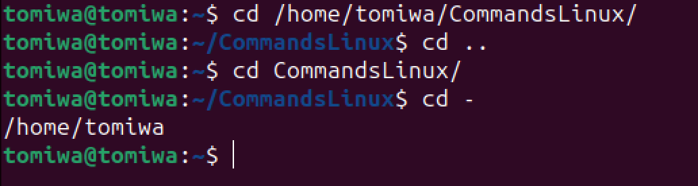
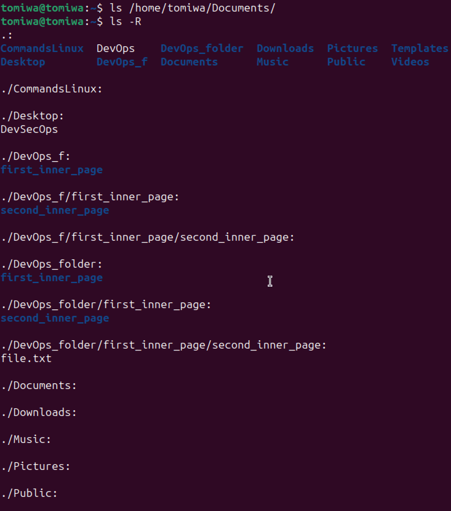
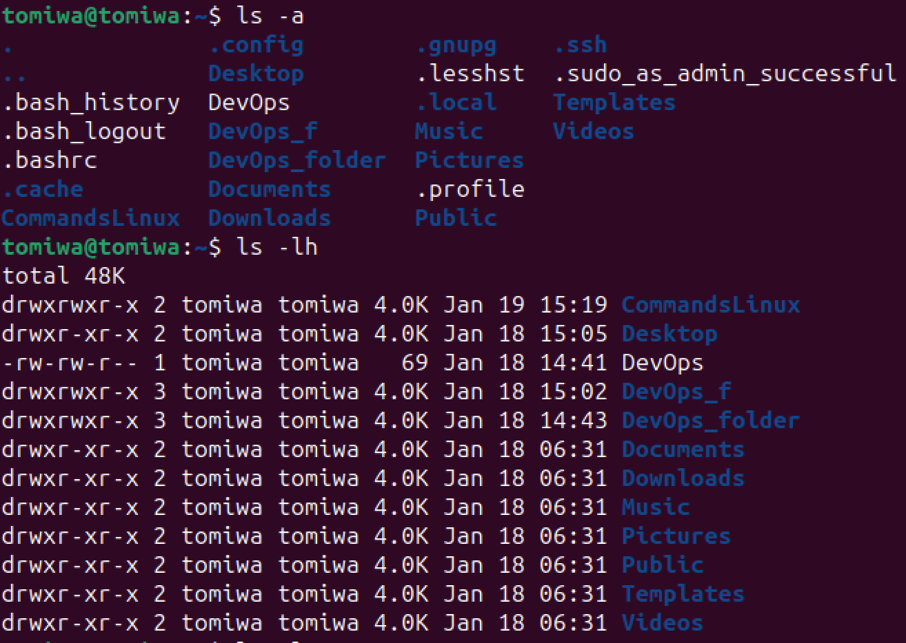
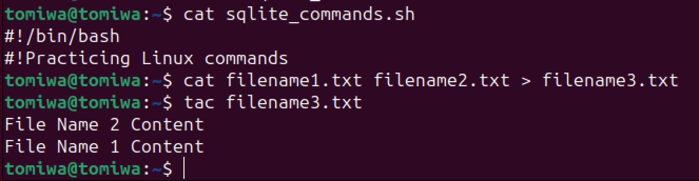
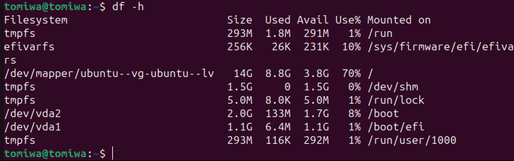
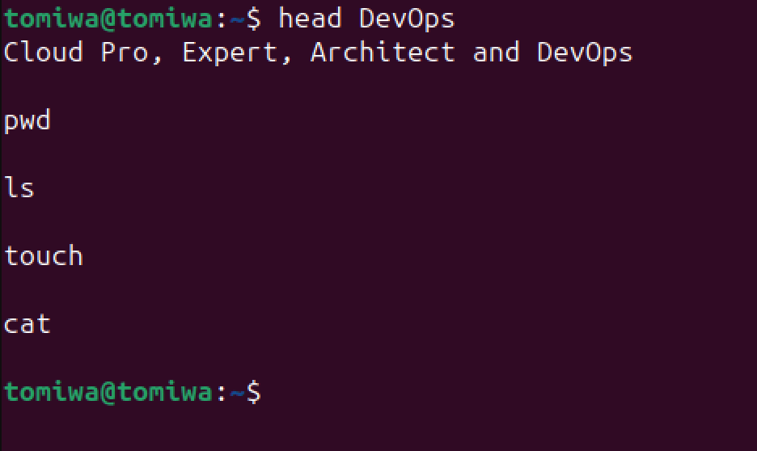

# Linux Practice

## File Manipulation

### 1. sudo command:

### 2. pwd command:

### 3. cd command:

### 4. ls command:

### 5. cat command:

### 6. cp command:

### 7. mv command:

### 8. mkdir command:

### 9. rmdir command:

### 10. rm command:

### 11. touch command:

### 12. locate command:

### 13. find command:

### 14. grep command:

### 15. df command:

### 16. du command:

### 17. head command:

### 18. tail command:

### 19. diff command:

### 20. tar command:
