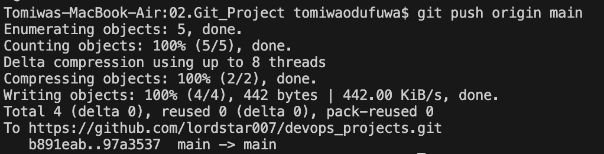

# Git 
Git is a distributed version control system (DVCS) designed to track changes in source code during software development. It allows multiple developers to collaborate on projects simultaneously, managing different versions of files and facilitating the merging of changes.

## Installing git

**1. Linux**

Git installation on Linux depends on the Linux distribution 
- Debian/Ubuntu 
```
apt update
apt install git
```
- Red Hat Enterprise Linux, CentOS, Fedora
```
yum update
yum install git
```
**2. Mac**

Git can be installed on Mac using the package manager, Homebrew. If Homebrew is not already installed, it can be installed using the command below
```
/bin/bash -c "$(curl -fsSL https://raw.githubusercontent.com/Homebrew/install/HEAD/install.sh)"
```
Git can then be installed using the command below:
```
brew install git
```
**3. Windows**

Install using the [git installer](https://git-scm.com/download/win) for windows


To confirm that git has been installed , the command below can be used to display the git version

```
git --version
```

## Basic Git Concepts
### Repository
A repository (repo) is a storage location where files and directories of a project are managed and tracked by Git. The repo contains all project file and directories along with metadata that records the history of changes made to those file over time. A repo can either be
- Local: repo residing on the developer's machine
- Remote: hosted on a server accessible to multiple users (e.g Github, GitLab)


### Commit
A commit in Git is a snapshot of changes made to files in a repository at a specific point in time. It represents a single unit of work and includes the modifications, additions, or deletions made to files since the last commit. Each commit is accompanied by a commit message, which provides a brief description of the changes introduced in the commit.

Objectives of a commit:
1. Track the history of a project
2. Allowing developers to review changes
3. Revert to previous states if necessary
4. Collaborate effectively with team members

_Screenshot below illustate the process of adding a file to be tracked by git and commiting changes to the file_


### Branches
A branch in Git refers to a parallel line of development that diverges from the main line, often called the 'master' branch. It allows developers to create a separate version of the project to work on specific updates or features without affecting the main codebase. Changes made in a branch can be independently developed, tested, and reviewed. Once the updates are completed and verified, the changes from the branch can be merged back into the main branch to incorporate the new features or fixes into the project

_Screenshot below illustrates the following_
- _Creating a new branch_
- _Merging the branch_
- _Deleting the branch_


### Push to remote repo
After making changes to the code in a local branch, developers typically push those changes to a remote repository. This action uploads the commits and associated files from the local branch to the remote repository, allowing other team members to access, review, and collaborate on the changes. Pushing to the remote repository is a crucial step in the Git workflow, enabling seamless collaboration




## Git Best Practices


1. **Use Meaningful Commit Messages**: Write clear and descriptive commit messages that explain the purpose and context of your changes.

2. **Create Descriptive Branch Names**: Use meaningful and descriptive names for branches that reflect the purpose or goal of the changes being made.

3. **Regularly Pull Changes**: Before starting work on a new feature or making changes, pull the latest changes from the remote repository to ensure you're working with the most up-to-date codebase.

4. **Commit Frequently and in Small Batches**: Make frequent commits to capture incremental changes to your code. This makes it easier to track changes, review code, and revert changes if needed.