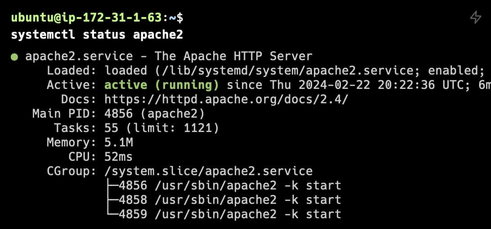
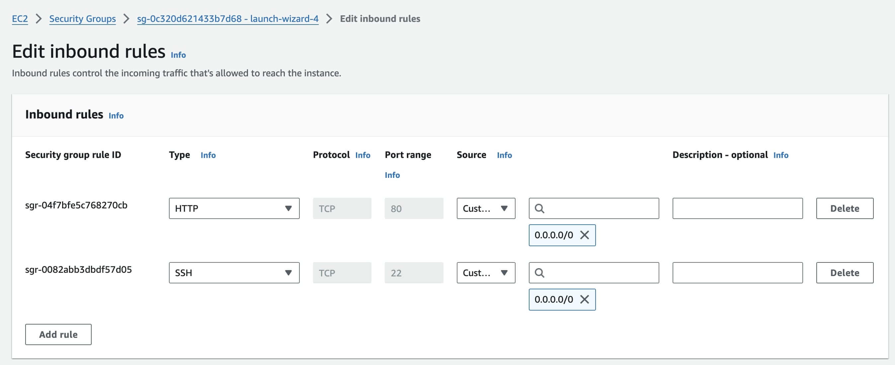
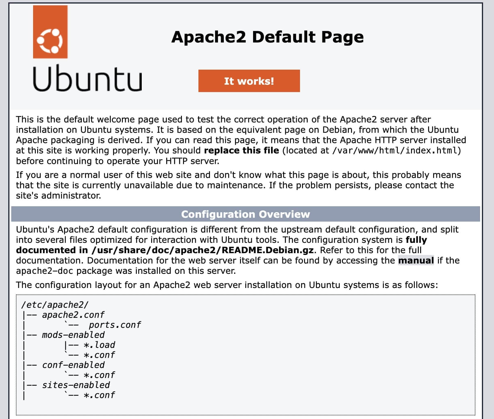
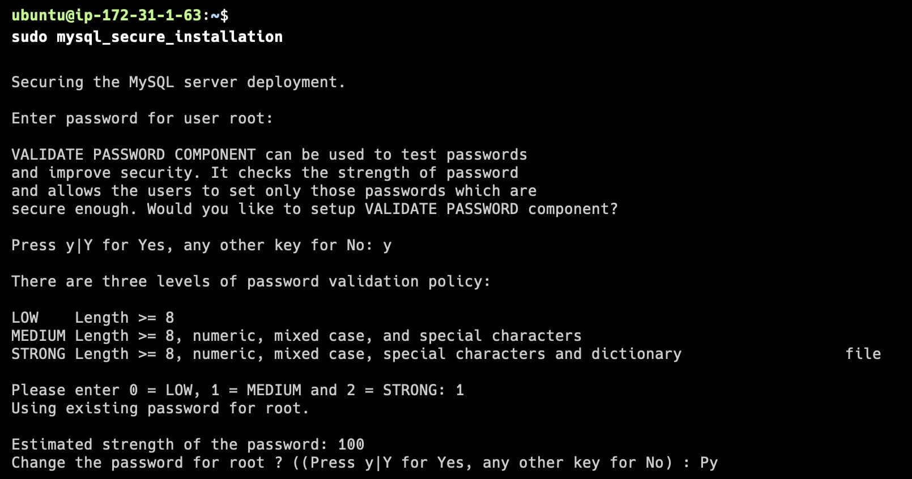
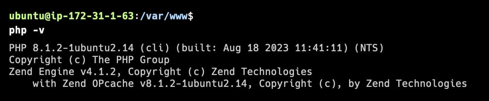
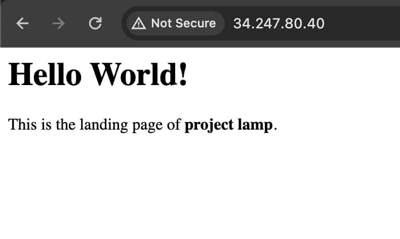
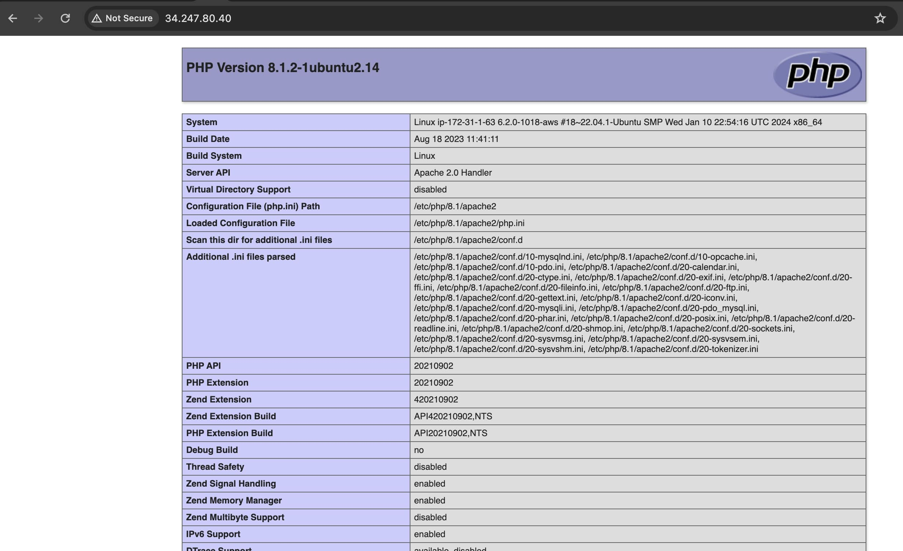

# LAMP Stack Implementation in AWS
This project outlines steps to setup LAMP stack on an AWS EC2 instance running ubuntu.

LAMP stands for Linux, Apache, MySQL and PHP

The setup is going to be done on an AWS EC2 instance running Ubuntu

## Connect to the EC2 instance through SSH
```
ssh -i "<private_key_file_name> ubuntu@<public_ip_address>
```
## Install Apache and update firewall
Steps to installing apache

1. update the local package index
```
sudo apt update
```
2. Install apache package using apt package manager
```
sudo apt install apache2
```
3. Check if apache2 is running
```
systemctl status apache2
```


For Apache to serve web pages through the browser, the EC2 instance must be able to accept incoming requests through port 80 which is the default port for HTTP traffic. This can be done by updating the inbound rules of the EC2 instance. Inbound rules can be found under security group



To view  the apache homepage, enter go to the public IP adrress in the browser over http

http://<public_ip_addres>



## Install MySQL and Setup MySQL
Steps to install MySQL:
1. Install mysql package using apt package manager
```
sudo apt install mysql-server
```
2. Login into the MySQL server as root
```
sudo mysql
```
3. Set a password for root user
```
mysql> ALTER USER 'root'@'localhost' IDENTIFIED WITH mysql_native_password BY 'chosen_password'
```
4. Exit MySQL serve
```
mysql> exit
```
5. Secure the mysql server using the "mysql_secure_installation command.
```
sudo mysql_secure_installation
```
This command does the following:
- Configured the VALIDATE PASSWORD PLUGIN to set password strength for all mysql users
- request to set root password
- Remove anonymous users
- Disallow root login remotely
- Remove test database 
- Remove test database



## Install PHP
Install php alongside php-mysql (php extension that enables php to commnicate with MySQL databases) and libapache2-mod-php (Appache module that enables Apache to process PHP scripts)
```
sudo apt install php php-mysql libapache2-mod-php
```

To confirm that php is installed run the command below to check for php version
```
php -v
```


## Configuring a virtual host
A virtual host allows for the hosting of more than one domain on a single Apache web server. We'll be setting up the domain "projectlamp"

1. create a directory for projectlamp in the /var/www folder. The project lamp directory will be created in the same directory as the "html" directory which is the default Apache directory
```
sudo mkdir /var/www/projectlamp
```

2. Change the owner of the directory from root to the system user
```
sudo chown -R $USER:$USER /var/www/projectlamp
```

3. Create an apache configuration file to confgure the directory for the "projectlamp" domain. The config. file is to be created in /etc/apache2/sites-available
```
sudo vim /etc/apache2/sites-available/projectlamp.conf
```

4. Paste the configuration code below
```
<VirtualHost *:80>
    ServerName projectlamp
    ServerAlias www.projectlamp 
    ServerAdmin webmaster@localhost
    DocumentRoot /var/www/projectlamp
    ErrorLog ${APACHE_LOG_DIR}/error.log
    CustomLog ${APACHE_LOG_DIR}/access.log combined
</VirtualHost>
```

5. Enable the new virtual host
```
sudo a2ensite projectlamp
```

6. Disable the default Apache website
```
sudo a2dissite 000-default
```

7. Test that the configuration has no errors
```
sudo apache2ctl configtest
```

8. Reload Apache for changes to take effect
```
sudo systemctl reload apache2
```
9. Visit the website the domain name or ip address


## Configure .php file to take precedence over.html file
By default, if an index.html and an index.php exists in the default directory. The index.html will be displayed over the index.php. To modify the order, take the following steps:
1. Open the dir.conf  Config file
```
sudo vi /etc/apache2/mods-enabled/dir.conf
```

2. Change the order in the file
```
<IfModule mod_dir.c>
        #Change this:
        #DirectoryIndex index.html index.cgi index.pl index.php index.xhtml index.htm
        #To this:
        DirectoryIndex index.php index.html index.cgi index.pl index.xhtml index.htm
</IfModule>
```
3. Reload the Apache server for changes to take effect
```
sudo systemctl reload apache2
```
4. Create an index.php file and add the php function phpinfo()
```
sudo echo '<?php phpinfo() ?>' > index.php
```

