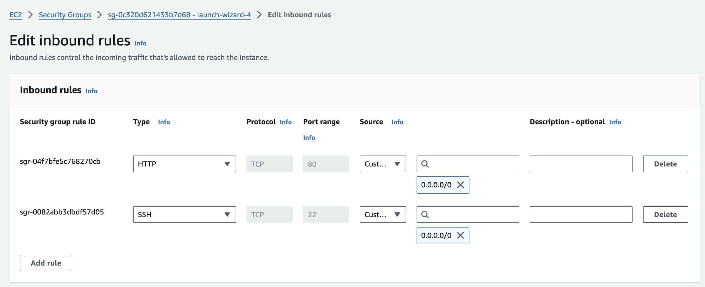
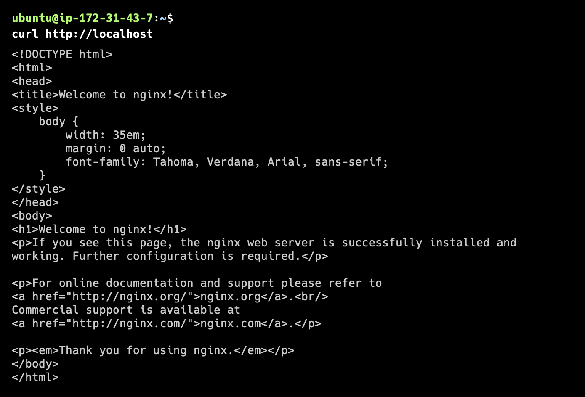
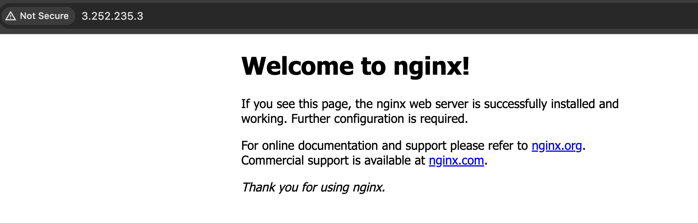
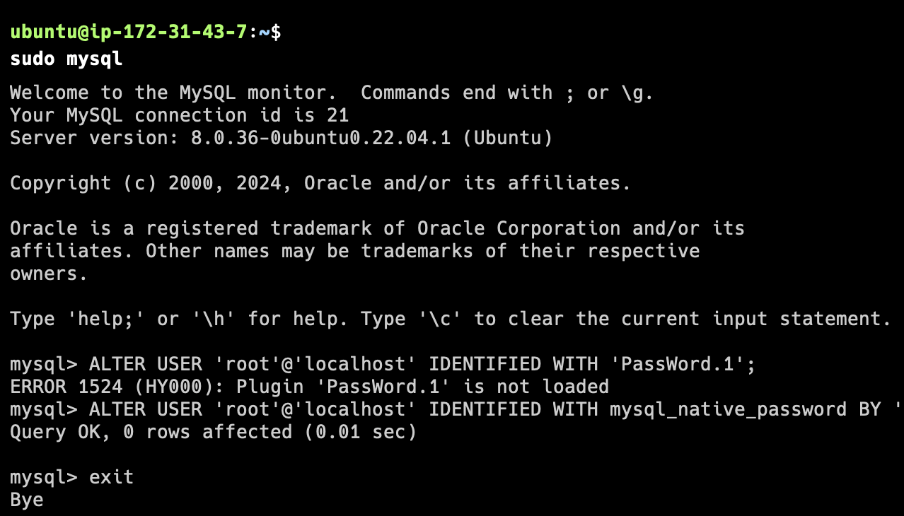
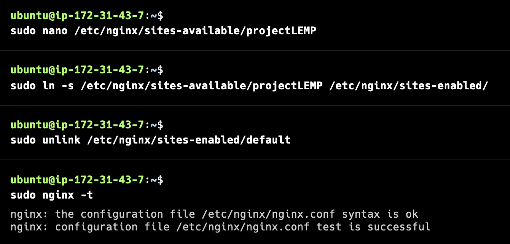
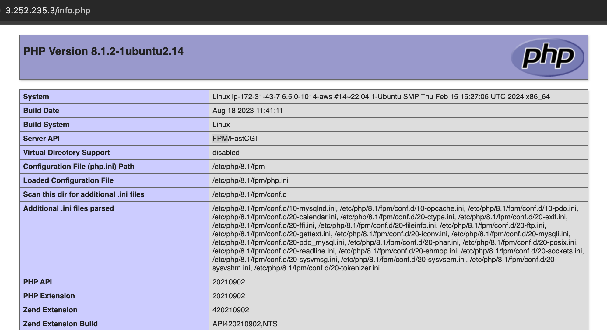
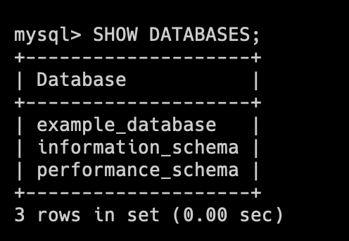
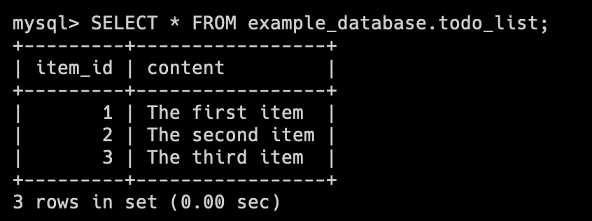
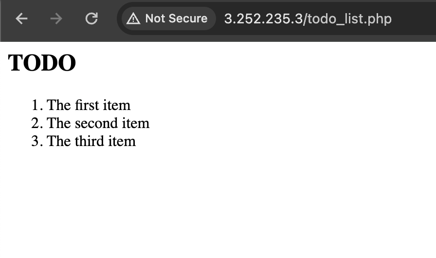

# LEMP Stack Implementation in AWS
LEMP stands for:
- Linux (the operating system)
- Nginx (the web server)
- MySQL (the database management system)
- PHP (the programming language)

## Installing the Nginx Web Server
1. Update apt package index and install Nginx
```
sudo apt update
sudo apt install nginx
```
2. Verify that Nginx is running
```
sudo systemctl status nginx
```
3. To access the default Nginx site, ensure that AWS EC2 is able to accept http requests through port 80. This can be done through security group


4. Access the default Nginx site throught the shell
```
curl http://localhost
curl http://127.0.0.1
```

5. Access the default site through the browser through the public url `http://<public_ip_address>`
6. Other than checking the AWS web console for the public IP you can also use this command
```
curl -s http://169.254.169.254/latest/meta-data/public-ipv4
```


## Install MySQL
1. Install MySQL
```
sudo apt install mysql-server
```
2. Log into mysql CLI

2. Set root password 
- Log into mysql
```
sudo mysql
```
- SQL command to update root password
```
mysql> ALTER USER 'root'@'localhost' IDENTIFIED WITH mysql_native_password BY 'chosen_password'; 
```
- exit mysql
```
mysql> exit 
```

3. It is recommended to secure the installation through a security script that come pre-installed with mysql. This command does the following:
- Configured the VALIDATE PASSWORD PLUGIN to set password strength for all mysql users
- request to set root password
- Remove anonymous users
- Disallow root login remotely
- Remove test database 
- Remove test database
```
sudo mysql_secure_installation
```
4. After setting the root password, to log in add the argument "-p" like below
```
sudo mysql -p
```

## Install PHP
1. To install PHP for Nginx, use the command below. The package 'php-fpm' installs PHP as well as 'php-fpm,' which acts as a bridge between PHP and Nginx. 'php-mysql' allows PHP to communicate with MySQL databases.
```
sudo apt install php-fpm php-mysql
```

## Configure Nginx to use PHP
The following steps describe how to setup server blocks to host multiple domains on the same server
1. create a directory in the "/var/www/" directory
```
sudo mkdir /var/www/your_domain
```

2. Assign the ownership to the $USER environment variable, which will reference the current system user
```
sudo chown -R $USER:$USER /var/www/your_domain 
```

3. Open a new configuration file in Nginx's 'site-available' directory
```
sudo nano /etc/nginx/sites-available/projectLEMP
```
- Enter the configuration script and return back to shell
```
server {
    listen 80;
    server_name your_domain www.your_domain;
    root /var/www/your_domain;

    index index.html index.htm index.php;

    location / {
        try_files $uri $uri/ =404;
    }

    location ~ \.php$ {
        include snippets/fastcgi-php.conf;
        fastcgi_pass unix:/var/run/php/php8.1-fpm.sock;
     }

    location ~ /\.ht {
        deny all;
    }

}
```

4. Activate the configuration by linking the configuration file to Nginx's site-enabled
```
sudo ln -s /etc/nginx/sites-available/projectLEMP /etc/nginx/sites-enabled/
```

5. Unlink the default configuration from the 'site-enabled' directory
sudo unlink /etc/nginx/sites-enabled/default

6. Test the configuration
sudo nginx -t



7. Restart the Nginx Server
systemctl reload nginx

8. On the browser access the site with the public IP Address or domain

http://<Public-IP-Address>:80

## Testing PHP
1. Create a file in the projectLEMP directory
```
nano /var/www/projectLEMP/info.php
```
2. Paste the code below
```
<?php
phpinfo();
```
3. Access the file through the browser
```
http://`server_domain_or_IP`/info.php
```

4. Delete the phpinfo.php file as it contains sensitive information
```
sudo rm /var/www/projectLEMP/info.php
```

## Retrieving Data from MySQL Database using PHP
1. Sign in to mysql CLI as root
```
sudo mysql -p
```

2. Create Database
```
mysql> CREATE DATABASE 'example_database';
```

3. Create a new user
```
mysql> CREATE USER 'example_user'@'%' IDENTIFIED WITH mysql_native_password BY 'PassWord.1';
```

4. Grant user permission over the example database
```
mysql> GRANT ALL ON example_database.* TO 'example_user'@'%'; 
```

5. Exit the mysql CLI
```
mysql> exit
```

6. Log into the mysql CLI with the newly created user
```
mysql -u example_user -p
```

7. Confirm access to the example_database database bychecking if it will show on the list of databases
```
mysql> SHOW DATABASES;
```


6. Create table
```
mysql> CREATE TABLE example_database.todo_list(item_id INT AUTO_INCREMENT, content VARCHAR(255), PRIMARY KEY(item_id));
```

7. Insert record into table
```
mysql> INSERT INTO example_database.todo_list (content) VALUES ("The very first todo")
```

8. View all records in the table
```
mysql> SELECT * FROM example_database.todo_list
```


9. Exit mysql CLI
```
exit
```
10. Create the php file to display the todo_list table records
```
sudo nano /var/www/projectLEMP/todo_list.php
```
11. Paste the following code. Update the database credentials as necessary
```
<?php
$user = "example_user";
$password = "PassWord.1";
$database = "example_database";
$table = "todo_list";

try {
  $db = new PDO("mysql:host=localhost;dbname=$database", $user, $password);
  echo "<h2>TODO</h2><ol>";
  foreach($db->query("SELECT content FROM $table") as $row) {
    echo "<li>" . $row['content'] . "</li>";
  }
  echo "</ol>";
} catch (PDOException $e) {
    print "Error!: " . $e->getMessage() . "<br/>";
    die();
}
```
12. Access the page through the public IP or domain
http://<Public_domain_or_IP>/todo_list.php
